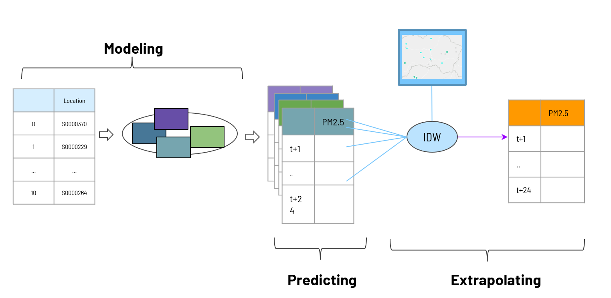

# AI4VN2022 - Air Quality Forecasting: Team LQDBD

## Our approach
### Presentation: [Slide](https://docs.google.com/presentation/d/1siq1gW3JPnu2Sd4Fcy72_Ygdg8SUryZVG5-LfjXAUZM/edit?usp=sharing)
### Pipeline
<p align="center">
   
</p>

## Reproduce our results

### Install required packages
```
pip install -r requirements.txt
python -m pip install -e .
```
### Data
We have put all contest data in this repo, you can move to `data/` folder to see its structure and create a custom dataset if you want.
### Running
We have provided all essential scripts `scripts/` that you could run to reproduce our results. You can look at these scripts to see the required params (if you want to tinker it).
# Contact
If you have any issue while running, raise an issue or privately mail [nqbinhcs](mailto:nqbinh.forwork@gmail.com), [hungnt14](mailto:ngtienhung14@gmail.com).
